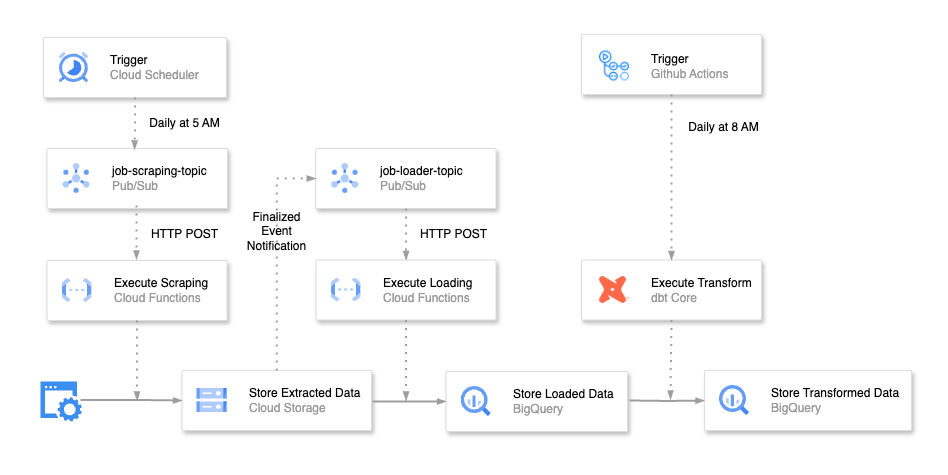

# tech-jobs-data-platform

## Overview
tech-jobs-data-platform is a data infrastructure system for analyzing technology-related job data. It provides a mechanism for scraping data from job sites and leveraging Google Cloud Platform (GCP) to efficiently manage and analyze the data.



## Technical Stack

### Cloud Services (GCP)
- **Cloud Run Functions (2nd gen)**
- **Cloud Storage** for source code and scraped data
- **Cloud Pub/Sub** for event-driven architecture
- **Cloud Scheduler** for daily execution
- **BigQuery** for data warehousing

### Infrastructure as Code
- **Terraform** for GCP resource provisioning
  - GCS backend for state management
  - Environment separation (dev/prod)

### Development Tools
- **Poetry** for dependency management
- **Ruff** for linting and formatting
- **MyPy** for type checking


## Development Setup

1. Clone the repository and install dependencies:

```bash
git clone https://github.com/your-repo/tech-jobs-data-platform.git
cd tech-jobs-data-platform
poetry install
```

2. Configure GCP credentials:

```bash
gcloud auth application-default login
```

3. Create env files and set your PROJECT_ID:

```
# .env.dev
PROJECT_ID=your-project-id-dev

# .env.prod
PROJECT_ID=your-project-id-prod

# functions/.env
cd functions
ln -s ../.env.dev .env

# terraform/env/dev.tfvars
project_id = your-project-id-dev
region     = youer-gcp-region-dev

# terraform/env/prod.tfvars
project_id = your-project-id-prod
region     = youer-gcp-region-prod
```

### Local Development 

1. linting and formatting 

```bash
# python 
make lint
make format

# terraform 
make tf-check
```

2. Run Cloud Functions locally:

```bash
# run scraper or loader function
make run-scraper
make run-loader

# test function 
curl http://localhost:8080
```

3. Run Terraform for development environment:

```bash
make tf-init-dev
make tf-apply-dev
```


### Production Deployment

```bash
make tf-init-prod
make tf-apply-prod
```
