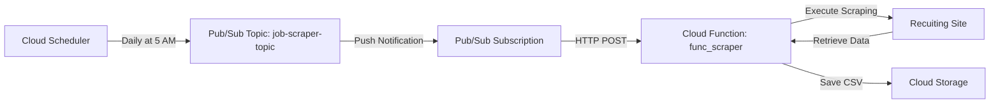
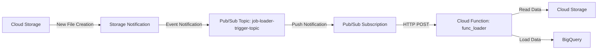

# tech-jobs-data-platform

## Overview
tech-jobs-data-platform is a data infrastructure system for analyzing technology-related job data. It provides a mechanism for scraping data from job sites and leveraging Google Cloud Platform (GCP) to efficiently manage and analyze the data.

## Features

Running these features on Cloud Run Functions
- Scraping data from job sites（`func_scraper`）
- Loading data to BigQuery（`func_loader`）

Planned
- Implementation of Dimensional Modeling using dbt

## Executing Flow

The system integrates multiple GCP services to create the following workflow:

1. Scraping

2. Loading

