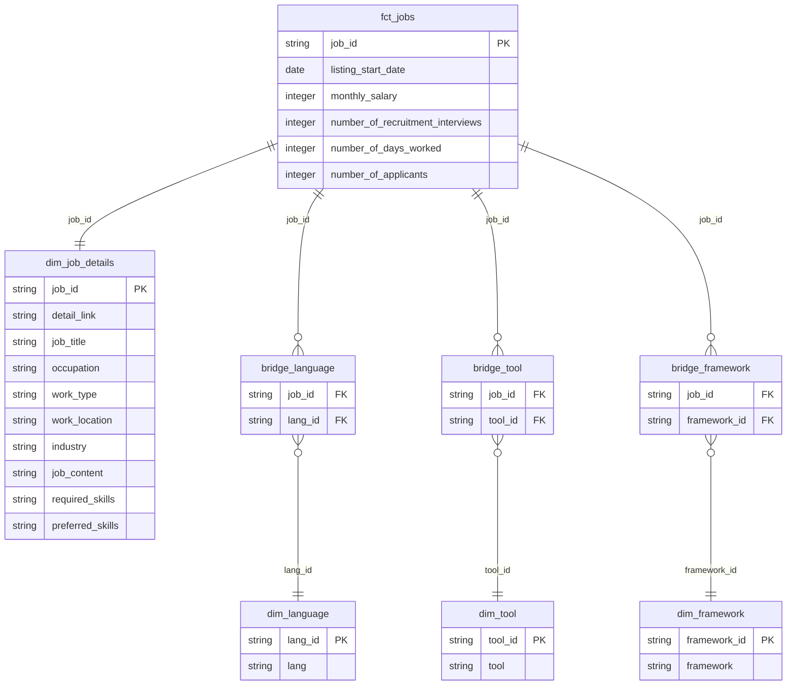

# Data Transformation

This directory contains a dbt project that manages data transformation processes in BigQuery.

## Data Model Structure



### Staging Layer
- **stg_joblist**: Standardization of raw data (lake__joblist)
  - String splitting (programming_language, tool, framework)
  - Numeric data type conversion
  - job_id generation (MD5 hash of detail_link)

### Mart Layer
#### Fact Tables
- **fct_jobs**: Quantitative information about job listings

#### Dimension Tables
- **dim_job_details**: Detailed job listing information
- **dim_language**: Programming language master
- **dim_tool**: Development environment and tools master
- **dim_framework**: Framework and library master

#### Bridge Tables (Many-to-Many Relationships)
- **bridge_language**: Jobs-Programming Languages
- **bridge_tool**: Jobs-Development Tools & Environments  
- **bridge_framework**: Jobs-Frameworks

## Usage

```bash
# build
make dbt-run-dev
make dbt-run-prod

# test
make dbt-test-dev
make dbt-test-prod
```
